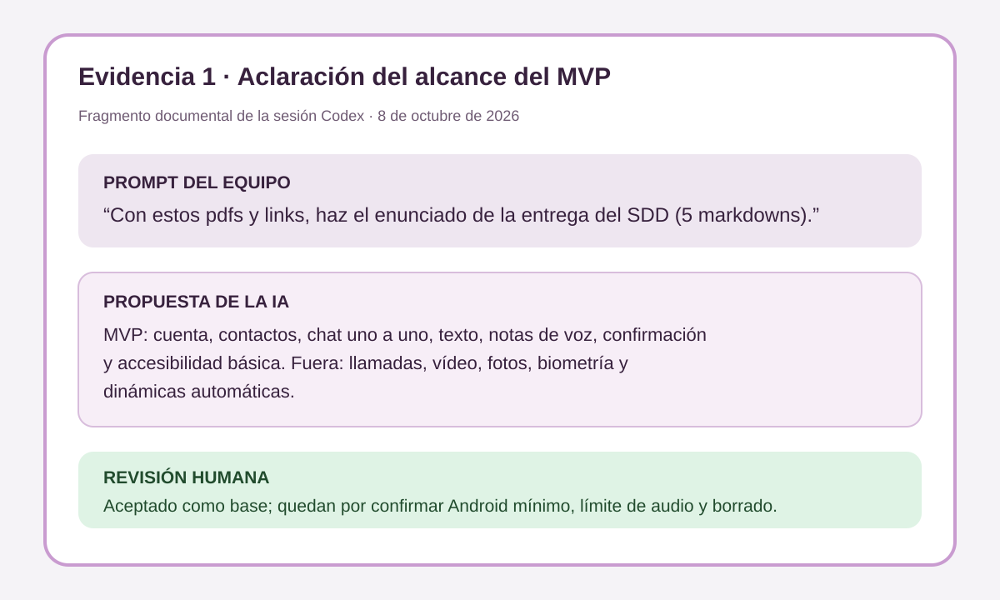
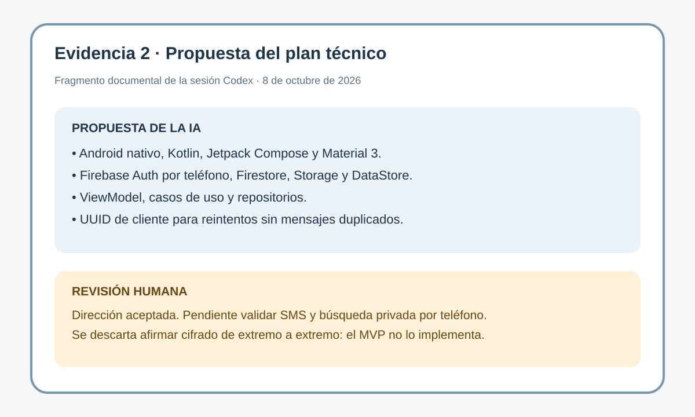
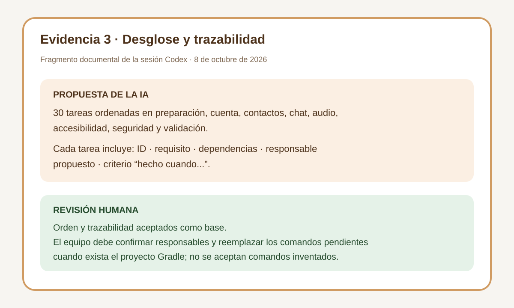

# Registro del uso de IA - NAMI

**Fase:** Spec Driven Development  
**Fecha:** 8 de octubre de 2026  
**Equipo:** Yangpeng Ni, Erik Brayan Agreda, Qingfei Meng y Víctor Iniesta Romera

## Contexto común de la sesión

El equipo facilitó al asistente el enunciado de la entrega SDD, dos documentos de Design Thinking y el prototipo de NAMI en Figma. El prompt principal fue:

> Con estos pdfs y links, haz el enunciado de la entrega del SDD (5 markdowns).

Después se añadió el prompt de refinamiento:

> Créalo también.

Este segundo mensaje pidió completar el registro adicional de IA y sus evidencias. Los archivos generados fueron revisados contra el enunciado y entre sí; las decisiones marcadas como pendientes siguen necesitando aprobación de las cuatro personas del equipo.

## Caso 1. Aclaración del alcance del MVP

### Tarea y objetivo

Convertir la investigación de Design Thinking y las pantallas de Figma en un alcance pequeño y comprobable para `spec.md`, separando lo imprescindible de las ideas para versiones posteriores.

### Herramienta o agente

- Herramienta: Codex en la aplicación de escritorio.
- Modelo LLM: no visible en la interfaz de la sesión.

### Modo de trabajo

Se utilizó el modo de agente con acceso de lectura a los PDF, consulta del archivo de Figma y edición de archivos locales. Este modo permitió comparar las fuentes y mantener la trazabilidad entre documentos.

### Contexto y prompts

Se proporcionaron los tres PDF, el enlace de Figma y el prompt principal citado al inicio. El asistente extrajo del prototipo las pantallas de cuenta, conversaciones, chat, perfil, contacto y ajustes, y contrastó esas pantallas con las prioridades del Design Thinking.

### Resultado y revisión humana

La IA propuso centrar el MVP en cuenta, contactos, conversaciones uno a uno, mensajes de texto, notas de voz, confirmación de envío y accesibilidad básica. También propuso dejar fuera llamadas, videollamadas, fotografías, biometría y dinámicas automáticas.

Se aceptó esta reducción porque conserva la propuesta de valor y permite validar el flujo principal en el tiempo disponible. El equipo aún debe confirmar el límite de duración del audio, la versión mínima de Android y la política de borrado. Si alguna exclusión cambia, deberán actualizarse `spec.md`, `plan.md` y `tasks.md` antes de programar.

### Evidencia

## Caso 2. Propuesta del plan técnico

### Tarea y objetivo

Preparar `plan.md` con una arquitectura viable, tecnologías justificadas, modelo de datos, relación con Figma y estrategia de pruebas.

### Herramienta o agente

- Herramienta: Codex en la aplicación de escritorio.
- Modelo LLM: no visible en la interfaz de la sesión.

### Modo de trabajo

Se utilizó el modo de agente y edición local para que la propuesta técnica quedara reflejada directamente en los documentos y pudiera revisarse junto al alcance.

### Contexto y prompts

Se reutilizó el prompt principal y el contexto completo de los PDF y Figma. El enunciado pedía tecnologías justificadas, componentes, datos, almacenamiento, correspondencia con pantallas y pruebas.

### Resultado y revisión humana

La IA propuso Android con Kotlin, Jetpack Compose, Firebase Authentication por teléfono, Firestore, Storage y DataStore, usando ViewModel, casos de uso y repositorios. También propuso identificadores idempotentes para evitar mensajes duplicados y reglas de backend que limiten cada conversación a sus participantes.

Se aceptó la dirección general porque encaja con 2.º DAM y el prototipo móvil. No se considera definitiva hasta que el equipo confirme las versiones, compruebe la viabilidad de la autenticación SMS y diseñe una búsqueda por teléfono que no permita enumerar personas. Se rechazó afirmar que existe cifrado de extremo a extremo, porque el MVP no lo implementa.

### Evidencia

## Caso 3. Desglose y trazabilidad de tareas

### Tarea y objetivo

Transformar requisitos funcionales y no funcionales en `tasks.md`: tareas pequeñas, ordenadas, con dependencias, responsable propuesto y criterio de finalización.

### Herramienta o agente

- Herramienta: Codex en la aplicación de escritorio.
- Modelo LLM: no visible en la interfaz de la sesión.

### Modo de trabajo

Se utilizó el modo de agente con edición local para contrastar automáticamente los identificadores de requisitos y mantener una matriz de trazabilidad.

### Contexto y prompts

Se usó el mismo prompt principal, junto con los requisitos `RF-01` a `RF-10` y `RNF-01` a `RNF-09` redactados durante la sesión.

### Resultado y revisión humana

La IA desglosó 30 tareas en preparación, cuenta, contactos, chat, audio, accesibilidad, seguridad y validación. Propuso responsables según áreas de trabajo y añadió una condición específica de “hecho cuando...” a cada tarea.

Se aceptó el orden y la trazabilidad como base de planificación. El reparto de personas es solo una propuesta: el equipo debe revisarlo según disponibilidad y experiencia. También debe sustituir los comandos `PENDIENTE_*` de `AGENTS.md` cuando exista el proyecto Gradle; no se aceptaron comandos inventados antes de crear el proyecto.

### Evidencia

## Reflexión final

La IA ayudó a convertir información dispersa de los PDF y Figma en documentos coherentes y trazables.  
Fue especialmente útil para redactar requisitos EARS, casos límite y criterios de aceptación verificables.  
También propuso una arquitectura y un desglose de tareas que el equipo pudo revisar como conjunto.  
Detectamos que podía convertir ideas del prototipo en alcance obligatorio, por lo que redujimos el MVP de forma explícita.  
Evitamos aceptar afirmaciones de seguridad no demostradas y dejamos pendientes las decisiones que requieren pruebas o acuerdo humano.  
La responsabilidad final sobre privacidad, accesibilidad, reparto de trabajo y viabilidad técnica sigue siendo del equipo.

